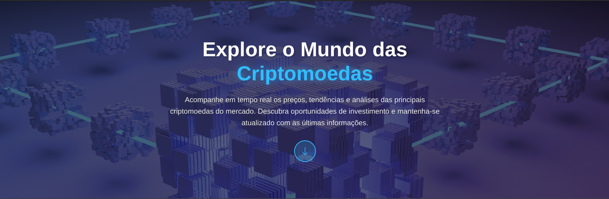
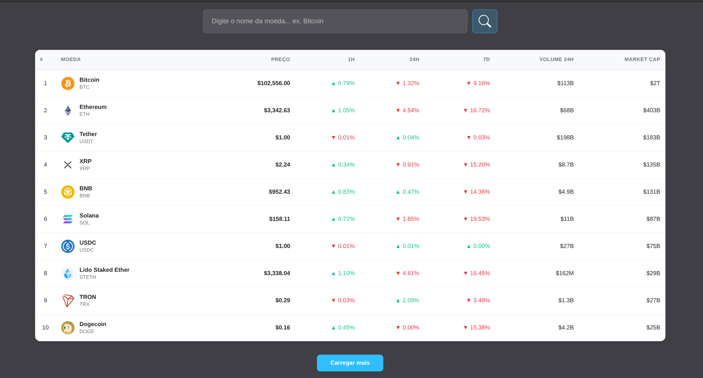
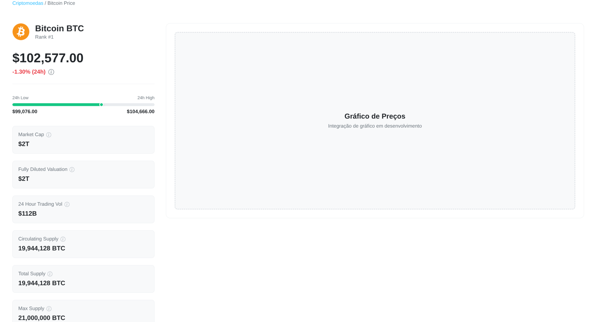

# Crypto App 💰

A modern, responsive cryptocurrency tracking application built with React and TypeScript. Track real-time cryptocurrency prices, market data, and detailed coin information with a beautiful, professional interface.

## 📸 Screenshots

### Hero Section

The landing page features a stunning hero section with gradient background and smooth scroll navigation.



### Cryptocurrency List

Professional table displaying top cryptocurrencies with comprehensive market data including prices, changes, and volume.



### Coin Detail Page

Detailed view of each cryptocurrency with market metrics, price range visualization, and comprehensive supply information.



## 📋 Table of Contents

- [Screenshots](#-screenshots)
- [About](#-about)
- [Features](#-features)
- [Project Flow](#-project-flow)
- [Technologies Used](#-technologies-used)
- [Installation](#-installation)
- [Usage](#-usage)
- [Project Structure](#-project-structure)
- [API](#-api)

## 🎯 About

Crypto App is a comprehensive cryptocurrency dashboard that allows users to:

- Browse the top cryptocurrencies by market cap
- Search for specific cryptocurrencies
- View detailed information about each cryptocurrency
- Track price changes over different time periods (1h, 24h, 7d)
- Monitor market metrics including market cap, volume, and supply data

The application features a modern hero section, professional data tables, and detailed coin pages with comprehensive market information.

## ✨ Features

- **Hero Section**: Eye-catching landing section with smooth scroll navigation
- **Cryptocurrency List**: Professional table displaying:
  - Coin ranking
  - Coin logo, name, and symbol
  - Current price
  - Price changes (1h, 24h, 7d) with visual indicators
  - 24h trading volume
  - Market capitalization
- **Search Functionality**: Intelligent search that finds cryptocurrencies by name or symbol
- **Detailed Coin Pages**: Comprehensive information including:
  - Current price with 24h change indicator
  - 24h price range visualization
  - Market cap and fully diluted valuation
  - Trading volume
  - Supply information (circulating, total, max)
  - Breadcrumb navigation
- **Responsive Design**: Fully responsive layout that works on desktop, tablet, and mobile devices
- **Real-time Data**: Fetches live data from CoinGecko API

## 🔄 Project Flow

### Application Structure

```
User enters application
    ↓
Hero Section (Landing Page)
    ↓
User clicks scroll button or scrolls down
    ↓
Cryptocurrency List Page
    ↓
User can:
    • Browse cryptocurrencies
    • Search for a specific coin
    • Click "Load More" to see additional coins
    • Click on a coin to view details
    ↓
Coin Detail Page
    ↓
User can:
    • View comprehensive coin information
    • See market metrics
    • Navigate back via breadcrumb
```

### Route Flow

1. **Home Route (`/`)**

   - Displays hero section
   - Shows list of top cryptocurrencies
   - Handles search functionality

2. **Detail Route (`/detail/:cripto`)**

   - Displays detailed information about selected cryptocurrency
   - Shows market data and metrics
   - Handles invalid coin IDs (redirects to home)

3. **NotFound Route (`*`)**
   - Catches any undefined routes
   - Displays 404 page

### Data Flow

```
API Request Flow:
    ↓
CoinGecko API
    ↓
Fetch cryptocurrency data
    ↓
Format and process data
    ↓
Update React state
    ↓
Render components
    ↓
User interaction triggers new requests
```

## 🛠 Technologies Used

### Core Dependencies

- **React** (`^18.3.1`)

  - Modern UI library for building user interfaces
  - Component-based architecture
  - Hooks for state management and side effects

- **React DOM** (`^18.3.1`)

  - React renderer for web applications

- **React Router DOM** (`^6.28.0`)

  - Client-side routing library
  - Enables navigation between pages without full page reloads
  - Used for: Home, Detail, and NotFound routes

- **React Icons** (`^5.3.0`)
  - Icon library providing popular icon sets
  - Used icons: `BsSearch`, `BsArrowDown`, `BsArrowDownCircle`, `BsInfoCircle`

### Development Dependencies

- **TypeScript** (`~5.6.2`)

  - Strongly typed programming language
  - Provides type safety and better developer experience
  - Type definitions for React components and props

- **Vite** (`^5.4.10`)

  - Next-generation frontend build tool
  - Fast development server with HMR (Hot Module Replacement)
  - Optimized production builds
  - Configured with proxy for API requests

- **@vitejs/plugin-react** (`^4.3.3`)

  - Vite plugin for React support
  - Enables JSX transformation and React Fast Refresh

- **ESLint** (`^9.13.0`)

  - Code linting tool for JavaScript/TypeScript
  - Ensures code quality and consistency

- **TypeScript ESLint** (`^8.11.0`)
  - ESLint rules for TypeScript
  - Catches type-related errors and code issues

### Build & Type Definitions

- **@types/react** (`^18.3.12`)
- **@types/react-dom** (`^18.3.1`)
  - TypeScript type definitions for React libraries

## 🚀 Installation

1. **Clone the repository**

   ```bash
   git clone <repository-url>
   cd criptoapp
   ```

2. **Install dependencies**

   ```bash
   npm install
   ```

3. **Start development server**

   ```bash
   npm run dev
   ```

4. **Build for production**

   ```bash
   npm run build
   ```

5. **Preview production build**
   ```bash
   npm run preview
   ```

## 📱 Usage

### Development Mode

Run `npm run dev` to start the Vite development server. The application will be available at `http://localhost:5173` (or the next available port).

### Features Usage

1. **Searching for a Cryptocurrency**

   - Type the name or symbol in the search bar
   - Press Enter or click the search icon
   - The app will find the coin and navigate to its detail page

2. **Viewing Coin Details**

   - Click on any cryptocurrency in the list
   - View comprehensive market information
   - Use breadcrumb navigation to return home

3. **Loading More Coins**
   - Click the "Load More" button at the bottom of the list
   - Additional cryptocurrencies will be loaded (10 at a time)

## 📁 Project Structure

```
criptoapp/
├── public/
│   └── vite.svg
├── src/
│   ├── assets/
│   │   └── logo.svg
│   ├── components/
│   │   ├── header/
│   │   │   ├── index.tsx
│   │   │   └── header.module.css
│   │   └── layout/
│   │       └── index.tsx
│   ├── config/
│   │   └── api.ts              # API configuration
│   ├── pages/
│   │   ├── detail/
│   │   │   ├── index.tsx       # Coin detail page
│   │   │   └── detail.module.css
│   │   ├── home/
│   │   │   ├── index.tsx       # Home page with coin list
│   │   │   └── home.module.css
│   │   └── notfound/
│   │       └── index.tsx       # 404 page
│   ├── App.tsx                 # Root component
│   ├── router.tsx              # Route configuration
│   ├── main.tsx                # Application entry point
│   ├── index.css               # Global styles
│   └── vite-env.d.ts           # Vite type definitions
├── index.html
├── package.json
├── tsconfig.json
├── tsconfig.app.json
├── tsconfig.node.json
├── vite.config.ts              # Vite configuration
└── README.md
```

### Key Files

- **`src/router.tsx`**: Defines all application routes
- **`src/config/api.ts`**: API endpoint configuration (CoinGecko)
- **`src/pages/home/index.tsx`**: Main page with cryptocurrency list
- **`src/pages/detail/index.tsx`**: Detailed coin information page
- **`src/components/layout/index.tsx`**: Layout wrapper with header

## 🌐 API

The application uses the **CoinGecko API** (free tier, no authentication required):

- **Base URL**: `https://api.coingecko.com/api/v3`
- **Endpoints Used**:
  - `/coins/markets` - Get cryptocurrency market data (list page)
  - `/coins/{id}` - Get detailed information about a specific coin
  - `/search` - Search for cryptocurrencies by name or symbol

### API Features

- Real-time cryptocurrency prices
- Market capitalization data
- Trading volume information
- Price change percentages (1h, 24h, 7d)
- Supply information (circulating, total, max)
- 24h high/low price ranges

## 🎨 Styling

The application uses **CSS Modules** for component-scoped styling:

- `.module.css` files for each component/page
- Global styles in `src/index.css`
- Responsive design with media queries
- Modern UI with gradients, shadows, and smooth transitions

## 📝 Scripts

- `npm run dev` - Start development server
- `npm run build` - Build for production
- `npm run preview` - Preview production build
- `npm run lint` - Run ESLint

## 🔧 Configuration

### Vite Configuration

The `vite.config.ts` includes:

- React plugin configuration
- Proxy setup for API requests (optional, for CORS handling)

### TypeScript Configuration

Separate configs for:

- Application code (`tsconfig.app.json`)
- Node scripts (`tsconfig.node.json`)
- Main configuration (`tsconfig.json`)

## 📄 License

This project is private and for educational purposes.

## 👨‍💻 Author

Built as part of a React with TypeScript course.

---

**Note**: This application uses the free tier of the CoinGecko API, which has rate limits. For production use, consider upgrading to a paid plan or implementing rate limiting/caching strategies.
