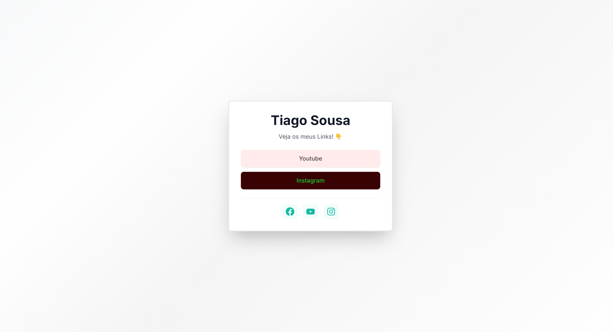
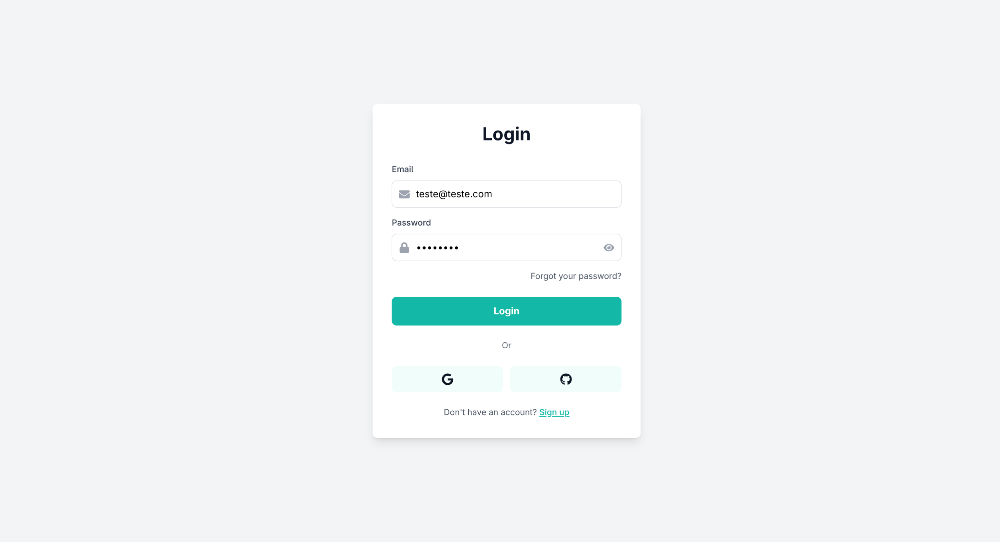
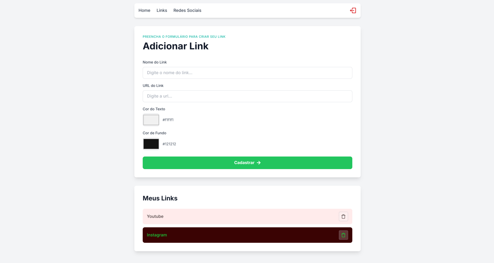

# 🔗 DevLink

A modern and elegant application to create and manage a personalized link page (similar to Linktree), developed with React, TypeScript, and Firebase. Allows users to create a unique page with their important links and social networks.

---

## 📸 Screenshots

### 🏠 Public Home Page
The main public page where visitors can access all your links and social networks.



### 🔐 Login Page
Secure authentication page with modern design and intuitive interface.



### ⚙️ Admin Panel - Links Management
Manage your links with full customization options including colors, preview, and organization.



### 📱 Social Media Configuration
Configure your social network links (Facebook, Instagram, YouTube) that appear on your public page.


---

## 🎯 About the Project

DevLink is a professional web application designed to help you create and manage a beautiful, personalized link page. Perfect for developers, content creators, influencers, and businesses who want to share all their important links in one place.

### 🎨 What Makes DevLink Special?

- **Beautiful Design**: Modern interface with elegant gradients and textures
- **Easy to Use**: Intuitive admin panel - no coding required
- **Fully Customizable**: Choose colors for each link to match your brand
- **Real-time Preview**: See how your links look before publishing
- **Mobile Responsive**: Looks great on all devices
- **Fast & Secure**: Built with modern technologies and Firebase security

---

## 📋 Table of Contents

- [About the Project](#-about-the-project)
- [Features](#-features)
- [Technologies Used](#-technologies-used)
- [Project Structure](#-project-structure)
- [Application Flow](#-application-flow)
- [Installation](#-installation)
- [Configuration](#-configuration)
- [Available Scripts](#-available-scripts)
- [Application Pages](#-application-pages)
- [Main Components](#-main-components)

## 🎯 About the Project

DevLink is a professional web application designed to help you create and manage a beautiful, personalized link page. Perfect for developers, content creators, influencers, and businesses who want to share all their important links in one place.

### Key Benefits

- **Professional Appearance**: Create a stunning public page that showcases all your links
- **Easy Management**: Simple admin panel to add, edit, and organize your links
- **Full Customization**: Customize colors, styles, and layout for each link
- **Social Integration**: Seamlessly integrate your social media profiles
- **Secure Access**: Protected admin area with Firebase authentication
- **Real-time Updates**: Changes appear instantly on your public page

## ✨ Features

- ✅ Email and password authentication system
- ✅ Create, edit, and delete personalized links
- ✅ Color customization (text and background) for each link
- ✅ Real-time preview of created links
- ✅ Social media link configuration
- ✅ Public page with elegant gradient and grainy texture
- ✅ Protected routes with authentication verification
- ✅ Responsive and modern interface
- ✅ Design with Tailwind CSS

## 🛠 Technologies Used

### Main Dependencies

- **[React](https://react.dev/)** (v18.3.1) - JavaScript library for building user interfaces
- **[TypeScript](https://www.typescriptlang.org/)** (v5.6.2) - JavaScript superset with static typing
- **[React Router DOM](https://reactrouter.com/)** (v6.28.0) - Routing for React applications
- **[Firebase](https://firebase.google.com/)** (v11.0.2) - Backend-as-a-Service platform
  - Firebase Authentication - User authentication
  - Cloud Firestore - Real-time NoSQL database
- **[React Icons](https://react-icons.github.io/react-icons/)** (v5.3.0) - Icon library
- **[Vite](https://vitejs.dev/)** (v5.4.10) - Modern and fast build tool

### Development Dependencies

- **[Tailwind CSS](https://tailwindcss.com/)** (v3.4.15) - Utility-first CSS framework
- **[ESLint](https://eslint.org/)** - Linter for JavaScript/TypeScript
- **[PostCSS](https://postcss.org/)** - Tool for transforming CSS
- **[Autoprefixer](https://github.com/postcss/autoprefixer)** - Automatically adds CSS prefixes

## 📁 Project Structure

```
devlink/
├── public/                 # Public static files
├── src/
│   ├── components/         # Reusable components
│   │   ├── Header/         # Application header
│   │   ├── Input/          # Input component
│   │   └── Social/         # Social links component
│   ├── pages/              # Application pages
│   │   ├── admin/          # Admin panel
│   │   ├── error/          # 404 error page
│   │   ├── home/           # Main public page
│   │   ├── login/          # Login page
│   │   └── networks/       # Social media management
│   ├── routes/             # Routes and route protection
│   │   └── Private.tsx     # Private route component
│   ├── services/           # Services and configurations
│   │   └── firebaseConnection.ts  # Firebase configuration
│   ├── App.tsx             # Route configuration
│   ├── main.tsx            # Application entry point
│   └── index.css           # Global styles
├── package.json            # Project dependencies
├── tailwind.config.js      # Tailwind configuration
├── tsconfig.json           # TypeScript configuration
└── vite.config.ts          # Vite configuration
```

## 🔄 Application Flow

### 1. Public Page (Home)
- Users visit the home page (`/`)
- View links registered by the administrator
- Can access configured links and social networks

### 2. Authentication
- User accesses `/login`
- Logs in with email and password via Firebase Authentication
- After authentication, is redirected to the admin panel

### 3. Admin Panel

#### Links Page (`/admin`)
- **Create Links**: Add new links with name, URL, and custom colors
- **Preview**: View how the link will look before saving
- **List Links**: See all created links
- **Delete Links**: Remove unwanted links

#### Social Networks Page (`/admin/social`)
- Configure Facebook, Instagram, and YouTube links
- These links appear as icons on the public page

### 4. Route Protection
- Administrative routes (`/admin` and `/admin/social`) are protected
- The `Private` component verifies authentication:
  - If not authenticated → redirects to `/login`
  - If authenticated → allows access to content

### 5. Data Persistence
- Data stored in **Cloud Firestore** (Firebase)
- **Collection `links`**: Stores personalized links
- **Document `social/link`**: Stores social networks
- Real-time synchronization with `onSnapshot`

## 🚀 Quick Start

### Prerequisites

Before you begin, ensure you have the following installed:
- **Node.js** (version 18 or higher) - [Download here](https://nodejs.org/)
- **npm** or **yarn** package manager
- **Firebase account** - [Create free account](https://firebase.google.com/)

### Installation Steps

#### 1. Clone the Repository
```bash
git clone <repository-url>
cd devlink
```

#### 2. Install Dependencies
```bash
npm install
```

#### 3. Set Up Firebase

1. Go to [Firebase Console](https://console.firebase.google.com/)
2. Create a new project (or use an existing one)
3. Enable **Authentication**:
   - Go to Authentication → Sign-in method
   - Enable **Email/Password** provider
4. Enable **Firestore Database**:
   - Go to Firestore Database
   - Create database in production mode
   - Set security rules (you can use test mode for development)
5. Get your configuration:
   - Go to Project Settings → General
   - Scroll to "Your apps" → Web app
   - Copy the Firebase configuration object

#### 4. Configure Firebase Connection

Edit `src/services/firebaseConnection.ts` and replace with your Firebase credentials:

```typescript
const firebaseConfig = {
  apiKey: "YOUR_API_KEY",
  authDomain: "YOUR_AUTH_DOMAIN",
  projectId: "YOUR_PROJECT_ID",
  storageBucket: "YOUR_STORAGE_BUCKET",
  messagingSenderId: "YOUR_MESSAGING_SENDER_ID",
  appId: "YOUR_APP_ID"
};
```

#### 5. Set Up Firestore Collections

In your Firebase Console, create the following structure:

**Collection: `links`**
- This collection will store your custom links
- Fields: `name` (string), `url` (string), `bg` (string), `color` (string), `created` (timestamp)

**Collection: `social`**
- Document ID: `link`
- Fields: `facebook` (string), `instagram` (string), `youtube` (string)

> 💡 **Note**: The collections will be created automatically when you first add data through the application.

#### 6. Run the Application

```bash
npm run dev
```

#### 7. Access the Application

- Open your browser and navigate to `http://localhost:5173`
- Create your first admin account on the login page
- Start adding your links!

### First Steps After Installation

1. **Create Admin Account**: Visit `/login` and sign up with your email
2. **Add Your Links**: Go to `/admin` and start creating your personalized links
3. **Configure Social Media**: Visit `/admin/social` to add your social network profiles
4. **Share Your Page**: Your public page is available at `/` - share it with the world!

## ⚙️ Configuration

### Firebase

Edit `src/services/firebaseConnection.ts`:

```typescript
const firebaseConfig = {
  apiKey: "YOUR_API_KEY",
  authDomain: "YOUR_AUTH_DOMAIN",
  projectId: "YOUR_PROJECT_ID",
  storageBucket: "YOUR_STORAGE_BUCKET",
  messagingSenderId: "YOUR_MESSAGING_SENDER_ID",
  appId: "YOUR_APP_ID"
};
```

### Firestore

Create the following collections in Firestore:

- **`links`**: To store links
  - Fields: `name`, `url`, `bg`, `color`, `created`
- **`social`**: For social networks
  - Document ID: `link`
  - Fields: `facebook`, `instagram`, `youtube`

## 📜 Available Scripts

```bash
# Development - starts development server
npm run dev

# Build - creates production build
npm run build

# Preview - previews production build
npm run preview

# Lint - checks code for errors
npm run lint
```

## 📄 Application Pages

### 🏠 Home Page (`/`)
Your public-facing page where visitors can access all your links.

**Features:**
- Displays all your registered links in an organized, beautiful layout
- Shows social media icons (Facebook, Instagram, YouTube) at the bottom
- Elegant gradient background with subtle texture
- Responsive design that works on all devices
- Each link is clickable and opens in a new tab

**How to Use:**
- Simply share your homepage URL with others
- Visitors can click any link to navigate to your content
- Social media icons link to your profiles

### 🔐 Login Page (`/login`)
Secure entry point to your admin panel.

**Features:**
- Modern, clean design with icon-enhanced fields
- Show/hide password toggle for security
- Form validation to ensure proper login
- Automatic redirect to admin panel after successful login
- "Forgot password" link (can be configured with Firebase)

**How to Use:**
1. Enter your registered email and password
2. Click "Sign in" or press Enter
3. You'll be automatically redirected to the admin panel

### ⚙️ Admin Panel - Links (`/admin`)
Your central hub for managing all your links.

**Features:**
- **Create Links**: Add new links with custom name, URL, and colors
- **Live Preview**: See exactly how your link will appear before saving
- **Color Customization**: Choose background and text colors for each link
- **Link Management**: View all your links in one place
- **Delete Links**: Remove links you no longer need

**How to Use:**
1. Fill in the link name and URL
2. Choose colors using the color pickers
3. See the preview of how it will look
4. Click "Cadastrar" (Register) to save
5. Your links appear in the list below
6. Click the trash icon to delete any link

### 📱 Social Media Configuration (`/admin/social`)
Manage your social network profiles that appear on your public page.

**Features:**
- Configure Facebook, Instagram, and YouTube links
- Icons automatically appear on your public page
- Changes save automatically to Firebase
- Easy-to-use form with icons

**How to Use:**
1. Enter your social media profile URLs
2. Click "Guardar Links" (Save Links)
3. Your social icons will appear on the home page

### ❌ Error Page (`/*`)
404 page for any routes that don't exist - helps users navigate back to your content.

## 🧩 Main Components

### Header
Navigation component used in administrative pages with:
- Navigation links (Home, Links, Social Networks)
- Logout button

### Private
Route protection component:
- Verifies authentication state
- Redirects to login if not authenticated
- Allows access if authenticated

### Input
Reusable input component with consistent styling.

### Social
Component to render social network links with icons.

## 🎨 Design

The project uses **Tailwind CSS** for styling, providing:

- Responsive and modern design
- Teal colors (#14b8a6) as main theme
- Gradients and textures for background
- Cards with elegant shadows and borders
- Smooth animations and transitions

## 📝 Data Structure

### Collection: `links`
```typescript
{
  id: string;
  name: string;        // Link name
  url: string;         // Destination URL
  bg: string;         // Background color (hex)
  color: string;      // Text color (hex)
  created: Timestamp; // Creation date
}
```

### Document: `social/link`
```typescript
{
  facebook: string;   // Facebook URL
  instagram: string;  // Instagram URL
  youtube: string;    // YouTube URL
}
```

## 🔒 Security

- Administrative routes protected by authentication
- Sensitive data stored securely in Firebase
- Frontend form validation
- Protection against unauthorized access

## 📚 Additional Resources

- [React Documentation](https://react.dev/)
- [TypeScript Documentation](https://www.typescriptlang.org/docs/)
- [Firebase Documentation](https://firebase.google.com/docs)
- [Tailwind CSS Documentation](https://tailwindcss.com/docs)
- [Vite Documentation](https://vitejs.dev/guide/)

## 👤 Author

Developed by **Tiago Sousa**

---

**DevLink** - Connect with purpose ✨
